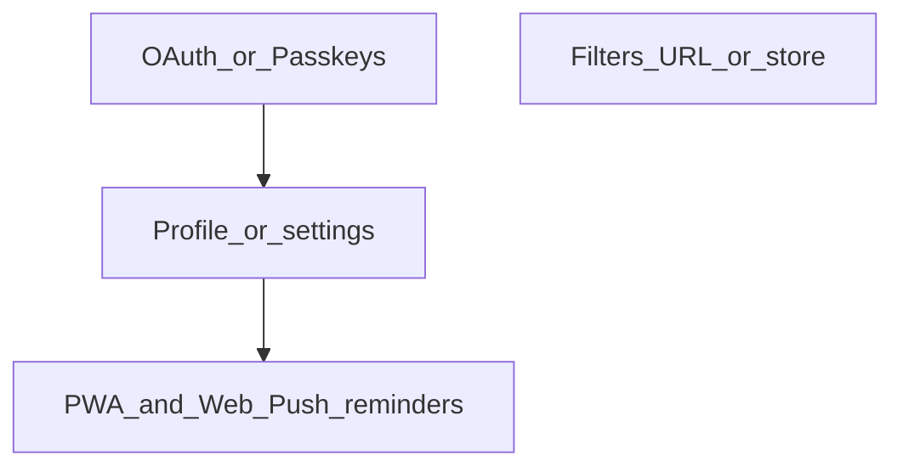

# Roadmap и бэклог

Краткий продуктовый и техбэклог: приоритеты, зависимости и идеи развития. Стек: Next.js (фронт), NestJS + JWT + Prisma (бэкенд), группы и персональные операции; фильтры на фронте через URL (`useTransactionsFilters`, `useGroupSelector`).

---

## Сделано

| Задача | Примечания |
|--------|------------|
| **Мультиязычность (i18n) на бэкенде** | `nestjs-i18n`, `AcceptLanguageResolver`, переводы по доменам (`errors`, `validation`, `userGroup`, `user`, `defaultCategories`); фронт передаёт `Accept-Language` из куки `NEXT_LOCALE` автоматически. Опционально позже: язык по умолчанию в профиле. |

---

## Приоритетный бэклог (основные темы)

Для каждого пункта ниже: **что**, **зачем**, **зависимости**, **сложность** (S/M/L — по желанию).

---

### 1. Фильтрация статистики и операций: стор или рефакторинг URL

**Что:** Один источник правды для периода, типа операции, категории и совместимости списка операций со статистикой.

**Сейчас:** Фильтры транзакций — в `src/feature/operation-filters/model/use-transactions-filters.ts`, синхронизация с **URL** (`type`, `period`, `startDate`, `endDate`, `categoryId`). Выбор группы — `src/feature/group-selector/model/use-group-selector.ts`, тоже через URL (`groupId`).

**Отдельный стор (Zustand и т.п.) имеет смысл, если нужно:**

- синхронизация между вкладками без опоры на URL;
- меньше `router.push` и гонок с `useEffect`, подставляющих дефолты в URL;
- общее состояние для виджетов вне одного route.

**Альтернатива:** Рефакторинг — единый модуль разбора `URLSearchParams`, URL остаётся single source of truth.

**Критерий успеха:** Нет дублирования между списком операций и статистикой; шаринг ссылки сохраняет фильтры.

**Зависимости:** Относительно независимо от остального.

**Сложность:** S–M.

---

### 2. Другие способы авторизации («быстрее» вход)

**Что:** Снизить трение при входе и регистрации.

**Сейчас:** NestJS, JWT, refresh по устройству (`deviceId`), email + пароль.

**Направления:**

- **OAuth2** (Google / Apple / GitHub)
- **Magic link** (email)
- **Passkeys / WebAuthn**

**Решение в бэклоге:** Самописное расширение модуля `auth` vs внешний поставщик (Clerk, Auth0, Supabase Auth и т.д.).

**Зависимости:** Влияет на экран настроек / профиля (привязка провайдеров, смена email).

**Сложность:** M–L.

---

### 3. Профиль и настройки

**Что:** Экран или шторка для данных аккаунта и предпочтений.

**Сейчас:** API `me` на бэкенде; продуктово можно начать с минимума: имя, смена пароля, список сессий/устройств (refresh уже завязан на `deviceId`).

**Варианты:** «Минимальные настройки в шапке» vs «отдельная страница профиля» + что нужно для OAuth и смены email.

**Зависимости:** Удобно иметь до тяжёлых сценариев с уведомлениями (настройки времени напоминаний).

**Сложность:** S–M.

---

### 4. PWA и Web Push (после профиля)

**Порядок:** Сразу **после** профиля/настроек — **PWA** и **напоминания** (например: «время внести расходы»).

**Состав работ:**

| Часть | Содержание |
|-------|------------|
| **PWA** | `manifest`, service worker (Next.js / Workbox или встроенные средства), иконки, `display: standalone`, при необходимости базовый офлайн/кэш. |
| **Web Push** | Разрешение (`Notification.requestPermission`), подписка через Push API, хранение **subscription** у пользователя на бэкенде, VAPID-ключи, эндпоинты подписки/отписки. |
| **Расписание** | Для «каждый день в 20:00» нужен **планировщик на сервере** (cron/worker), который рассылает push по сохранённым подпискам; только клиентский таймер ненадёжен при закрытой вкладке. |
| **UI** | Время напоминания, вкл/выкл — в **профиле/настройках**. |

**Зависимости:** Профиль (§3) как место для настроек напоминаний.

**Сложность:** M–L.

---

## Идеи развития (кандидаты)

| Направление | Зачем |
|-------------|--------|
| **Роли в группе** (владелец / редактор / только чтение) | В схеме пока нет `role` / `permission` — для совместных групп частый шаг. |
| **Мультитенантность на бэкенде** | Не путать с i18n: отдельная крупная тема (tenant, изоляция данных), если понадобится SaaS или жёсткая изоляция. |
| **Экспорт / импорт (CSV)** | Резерв и перенос из других приложений. |
| **Повторяющиеся операции** | Подписки, аренда. |
| **Бюджеты / лимиты по категории** | Логично после статистики. |
| **Статистика по участникам группы** | Не только разбивка по категориям: по каждому пользователю — сколько потратил за выбранный период в группе (прозрачность совместных расходов). Зависит от того, что операции в группе привязаны к автору. |
| **Предупреждение при смене дефолтной категории** | В форме редактирования категории: если пользователь меняет признак «дефолтная категория», показать предупреждение — это может повлиять на дефолтное сопоставление групповых категорий с его персональными. |
| **Несколько валют + курс** | Если аудитория не только RUB. |
| **Полнотекстовый поиск** по комментариям и суммам | Когда операций много. |
| **PWA + Web Push** | См. §4 — приоритетный этап **после профиля**. |
| **Email-дайджесты** | Отдельно от push, если нужно без браузера. |
| **2FA** | При усилении безопасности (OAuth, почта). |
| **Интеграции с банками** | Дорого в поддержке; отдельная ветка продукта. |

---

## Зависимости (схема)

**Смысл:** OAuth влияет на настройки аккаунта; профиль — база для напоминаний, затем PWA и push; фильтры относительно автономны. **Роли в группе** — отдельная тема из таблицы идей, на схеме без жёстких стрелок к текущему бэклогу.

---

## Ссылки на код (фронт)

- Фильтры транзакций: `src/feature/operation-filters/model/use-transactions-filters.ts`
- Выбор группы: `src/feature/group-selector/model/use-group-selector.ts`

Бэкенд: схема БД — репозиторий `finance-track-back`, файл `prisma/schema.prisma`; авторизация — `src/auth/` (NestJS).
