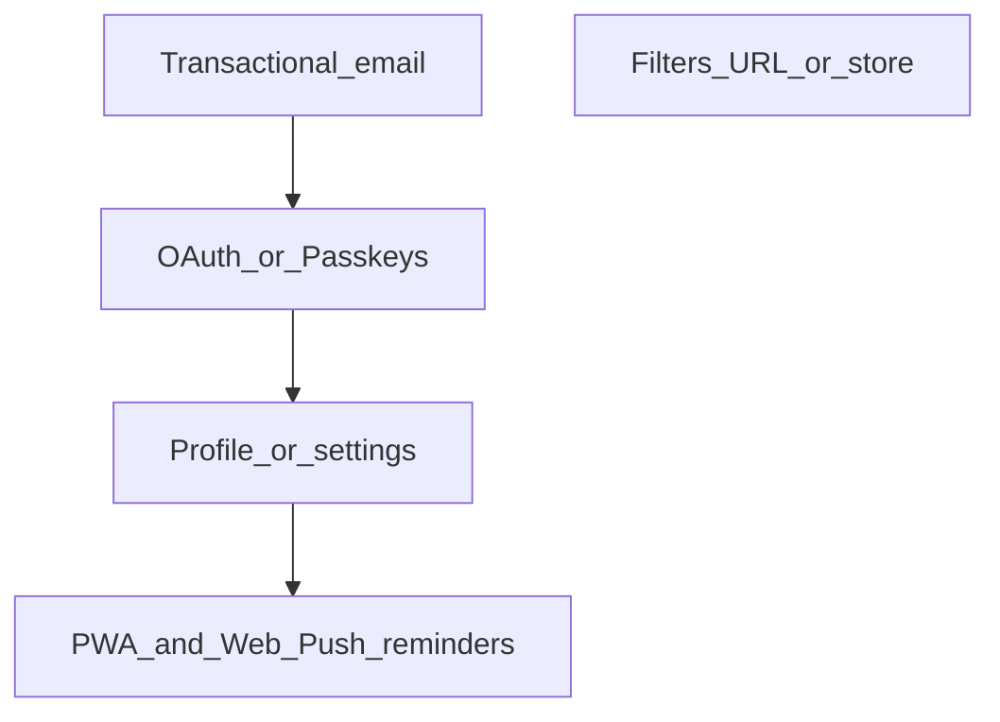

# Roadmap и бэклог

Краткий продуктовый и техбэклог: приоритеты, зависимости и идеи развития. Стек: Next.js (фронт), NestJS + JWT + Prisma (бэкенд), группы и персональные операции; фильтры на фронте через URL (`useTransactionsFilters`, `useGroupSelector`).

---

## Сделано

| Задача | Примечания |
|--------|------------|
| **Мультиязычность (i18n) на бэкенде** | `nestjs-i18n`, `AcceptLanguageResolver`, переводы по доменам (`errors`, `validation`, `userGroup`, `user`, `defaultCategories`); фронт передаёт `Accept-Language` из куки `NEXT_LOCALE` автоматически. Опционально позже: язык по умолчанию в профиле. |
| **Профиль и настройки (минимум)** | Страница профиля (`app/profile`, виджет `profile-overview`): `auth/me`, смена имени (`PATCH auth/profile`), смена пароля (`POST auth/change-password`), список сессий и отзыв (`GET` / `DELETE auth/sessions`), refresh по `deviceId`. Дальше: смена email, привязка OAuth, настройки напоминаний — в бэклоге (§1, §3, §4 PWA). |

---

## MVP и безопасность: обязательный минимум перед продакшном

Единый чеклист: **продукт**, **безопасность кода**, **эксплуатация**, **право**. Часть пунктов дублирует §1–§4 приоритетного бэклога и идеи из таблицы ниже — так и задумано: этот блок можно использовать как «стрелку в землю» перед релизом. Для закрытой беты на знакомых допускается сознательно отложить юр. часть и верификацию email, но **сброс пароля**, **IDOR** и **бэкапы** остаются желательными почти всегда.

### Продукт и доступ

| Приоритет | Задача | Примечание |
|-----------|--------|------------|
| Критично | **Восстановление доступа** (сброс пароля по ссылке из письма) | Смена пароля только из профиля не спасает забывших пароль; без почты — ручной саппорт в БД. |
| Критично | **Транзакционная почта** | См. §1: провайдер (Resend, Postmark…), шаблоны, ретраи; база для сброса и при желании верификации email. |
| Высокий | **Верификация email** (поле вроде `emailVerified`, одноразовые токены) | Для публичного запуска; для узкой беты можно второй волной после сброса пароля. |
| — | **Профиль / сессии (минимум)** | **Сделано** — см. таблицу «Сделано». Расширения (смена email и т.п.) — §1 и бэклог. |

### Безопасность приложения (код и конфиг)

| Приоритет | Задача | Примечание |
|-----------|--------|------------|
| Критично | **IDOR: операции** | `GET/PUT/DELETE /operation/:id` — везде проверять, что ресурс принадлежит `userId` из JWT; запросы к репозиторию с `where: { id, userId }` (или эквивалент). |
| Критично | **IDOR: категории** | `GET /category/:id`, `PUT /category/:id` — проверка владельца; `update` в репозитории не обновлять только по `id`. |
| Критично | **Создание операции** | Перед `create`: убедиться, что `categoryId` принадлежит текущему пользователю (сейчас возможна привязка к чужой категории и рассинхрон данных). |
| Высокий | **Refresh-токен** | После проверки JWT сверять сырое значение refresh с **bcrypt-хешем** в БД (`AuthRepository`); иначе ротация и «один актуальный токен» ослаблены. |
| Высокий | **Парсинг `Cookie` для refresh** | Заменить хрупкий `split('=')` в refresh-стратегии на нормальный парсер / `req.cookies` (после `cookie-parser`). |
| Высокий | **Куки в проде** | `secure: true` для access/refresh при HTTPS; вынести в env (`NODE_ENV` / `COOKIE_SECURE`). |
| Средний | **Rate limiting** | Лимиты на `auth/login`, `auth/registration` (брутфорс). |
| Средний | **Swagger / OpenAPI** | В публичном проде отключить или закрыть (VPN, Basic Auth), не светить схему API. |
| Средний | **BFF** (`Next` route handler прокси) | После refresh повторный запрос к API должен пробрасывать те же заголовки, что и исходный (в т.ч. `Content-Type`, `Accept-Language`); минимизировать прокидывание всех клиентских заголовков на бэкенд без необходимости. |
| Низкий | **Access token в теле ответа** | Сейчас дублируется с httpOnly cookie; при желании ужать риск утечки через XSS на этапе логина — не отдавать токен в JSON, оставить только cookie. |
| Низкий | **Политика паролей** | Сейчас минимум 6 символов; для финансов — длиннее и/или проверка на утечки (опционально). |

### Эксплуатация (инфраструктура)

| Приоритет | Задача | Примечание |
|-----------|--------|------------|
| Критично | **Бэкапы PostgreSQL** | Регулярные, проверенные восстановлением. |
| Высокий | **Мониторинг и алерты** | 5xx, диск, БД, длительность запросов — минимальный набор. |
| Высокий | **Секреты** | `JWT_SECRET_CODE`, `JWT_REFRESH_SECRET`, `DATABASE_URL`, ключи почты — только в секрет-хранилище / env деплоя, не в репозитории. |
| Средний | **Откат релиза** | Понятный процесс деплоя бэка + фронта (и миграций Prisma). |

### Данные, группы, право

| Приоритет | Задача | Примечание |
|-----------|--------|------------|
| Высокий | **Политика конфиденциальности** | Если пользователи не только вы: персональные и финансовые данные. |
| По продукту | **Роли в группе** | См. таблицу идей: для «только семья» часто терпимо без ролей; для незнакомцев в одной группе — почти обязательный следующий шаг. |

### Критерий «можно открывать шире бету»

- Пройдены пункты **критично** из таблиц выше (включая исправление IDOR и восстановление доступа через почту).
- Есть бэкапы и способ узнать, что API/БД «легли».
- Осознанно принято решение по верификации email и юридическим текстам под тип запуска.

---

## Приоритетный бэклог (основные темы)

Для каждого пункта ниже: **что**, **зачем**, **зависимости**, **сложность** (S/M/L — по желанию).

---

### 1. Транзакционная email-рассылка (инфраструктура письма)

**Что:** Настроить доставку писем с бэкенда (SMTP / транзакционный провайдер — Resend, SendGrid, Postmark и т.п.): шаблоны, локаль при необходимости, очереди/ретраи по месту.

**Зачем в первую очередь:**

- **Подтверждение email при регистрации** — снижение фейковых аккаунтов, опора для восстановления доступа и смены почты.
- **Повторная отправка письма / истёкшая ссылка** — UX на фронте (страница «проверьте почту», кнопка «отправить снова»).

**Типичные соседние сценарии (можно закладывать тем же контурами, но не обязательно сразу):**

- **Сброс пароля** («забыли пароль») — если появится отдельно от смены пароля в профиле.
- **Подтверждение нового адреса** при смене email в профиле.
- **Magic link** (см. §3) — по сути те же письма со ссылкой.
- Маркетинговые **email-дайджесты** из таблицы идей — отдельный продуктовый слой (подписка, отписка), не смешивать с транзакционной очередью без осознанного решения.

**Фронт:** экраны и состояния для верификации по ссылке из письма, сообщения об ошибках токена, при необходимости — отдельный поток сброса пароля.

**Зависимости:** Бэкенд: поля вроде `emailVerified`, хранение одноразовых токенов, эндпоинты; фронт — маршруты и формы. Пункт **«Другие способы авторизации»** (§3) и **расширения профиля** (смена email и т.п.; базовый профиль — в «Сделано») выигрывают от уже работающей доставки писем.

**Сложность:** M (инфраструктура + безопасность токенов + UX).

---

### 2. Фильтрация статистики и операций: стор или рефакторинг URL

**Что:** Один источник правды для периода, типа операции, категории и совместимости списка операций со статистикой.

**Сейчас:** Фильтры транзакций — в `src/feature/operation-filters/model/use-transactions-filters.ts`, синхронизация с **URL** (`type`, `period`, `startDate`, `endDate`, `categoryId`). Выбор группы — `src/feature/group-selector/model/use-group-selector.ts`, тоже через URL (`groupId`).

**Отдельный стор (Zustand и т.п.) имеет смысл, если нужно:**

- синхронизация между вкладками без опоры на URL;
- меньше `router.push` и гонок с `useEffect`, подставляющих дефолты в URL;
- общее состояние для виджетов вне одного route.

**Альтернатива:** Рефакторинг — единый модуль разбора `URLSearchParams`, URL остаётся single source of truth.

**Критерий успеха:** Нет дублирования между списком операций и статистикой; шаринг ссылки сохраняет фильтры.

**Зависимости:** Относительно независимо от остального.

**Сложность:** S–M.

---

### 3. Другие способы авторизации («быстрее» вход)

**Что:** Снизить трение при входе и регистрации.

**Сейчас:** NestJS, JWT, refresh по устройству (`deviceId`), email + пароль.

**Направления:**

- **OAuth2** (Google / Apple / GitHub)
- **Magic link** (email)
- **Passkeys / WebAuthn**

**Решение в бэклоге:** Самописное расширение модуля `auth` vs внешний поставщик (Clerk, Auth0, Supabase Auth и т.д.).

**Зависимости:** Влияет на экран настроек / профиля (привязка провайдеров, смена email).

**Сложность:** M–L.

---

### 4. PWA и Web Push (после базового профиля)

**Порядок:** Базовый профиль уже в **«Сделано»**; дальше **PWA** и **напоминания** (например: «время внести расходы»).

**Состав работ:**

| Часть | Содержание |
|-------|------------|
| **PWA** | `manifest`, service worker (Next.js / Workbox или встроенные средства), иконки, `display: standalone`, при необходимости базовый офлайн/кэш. |
| **Web Push** | Разрешение (`Notification.requestPermission`), подписка через Push API, хранение **subscription** у пользователя на бэкенде, VAPID-ключи, эндпоинты подписки/отписки. |
| **Расписание** | Для «каждый день в 20:00» нужен **планировщик на сервере** (cron/worker), который рассылает push по сохранённым подпискам; только клиентский таймер ненадёжен при закрытой вкладке. |
| **UI** | Время напоминания, вкл/выкл — в **профиле/настройках**. |

**Зависимости:** Расширение экрана профиля (см. «Сделано») как место для настроек напоминаний.

**Сложность:** M–L.

---

## Идеи развития (кандидаты)

| Направление | Зачем |
|-------------|--------|
| **Роли в группе** (владелец / редактор / только чтение) | В схеме пока нет `role` / `permission` — для совместных групп частый шаг. |
| **Мультитенантность на бэкенде** | Не путать с i18n: отдельная крупная тема (tenant, изоляция данных), если понадобится SaaS или жёсткая изоляция. |
| **Экспорт / импорт (CSV)** | Резерв и перенос из других приложений. |
| **Повторяющиеся операции** | Подписки, аренда. |
| **Бюджеты / лимиты по категории** | Логично после статистики. |
| **Статистика по участникам группы** | Не только разбивка по категориям: по каждому пользователю — сколько потратил за выбранный период в группе (прозрачность совместных расходов). Зависит от того, что операции в группе привязаны к автору. |
| **Предупреждение при смене дефолтной категории** | В форме редактирования категории: если пользователь меняет признак «дефолтная категория», показать предупреждение — это может повлиять на дефолтное сопоставление групповых категорий с его персональными. |
| **Несколько валют + курс** | Если аудитория не только RUB. |
| **Полнотекстовый поиск** по комментариям и суммам | Когда операций много. |
| **PWA + Web Push** | См. §4 в приоритетном бэклоге — после базового профиля («Сделано»). |
| **Email-дайджесты** | Отдельно от push, если нужно без браузера. |
| **2FA** | При усилении безопасности (OAuth, почта). |
| **Интеграции с банками** | Дорого в поддержке; отдельная ветка продукта. |

---

## Зависимости (схема)

**Смысл:** Транзакционная почта (§1) — база для подтверждения регистрации и смежных сценариев до расширений auth; OAuth влияет на настройки аккаунта; базовый профиль уже в «Сделано» — на его фоне PWA/push (§4); фильтры относительно автономны. **Роли в группе** — отдельная тема из таблицы идей, на схеме без жёстких стрелок к текущему бэклогу.

---

## Ссылки на код (фронт)

- Фильтры транзакций: `src/feature/operation-filters/model/use-transactions-filters.ts`
- Выбор группы: `src/feature/group-selector/model/use-group-selector.ts`

Бэкенд: схема БД — репозиторий `finance-track-back`, файл `prisma/schema.prisma`; авторизация — `src/auth/` (NestJS).
