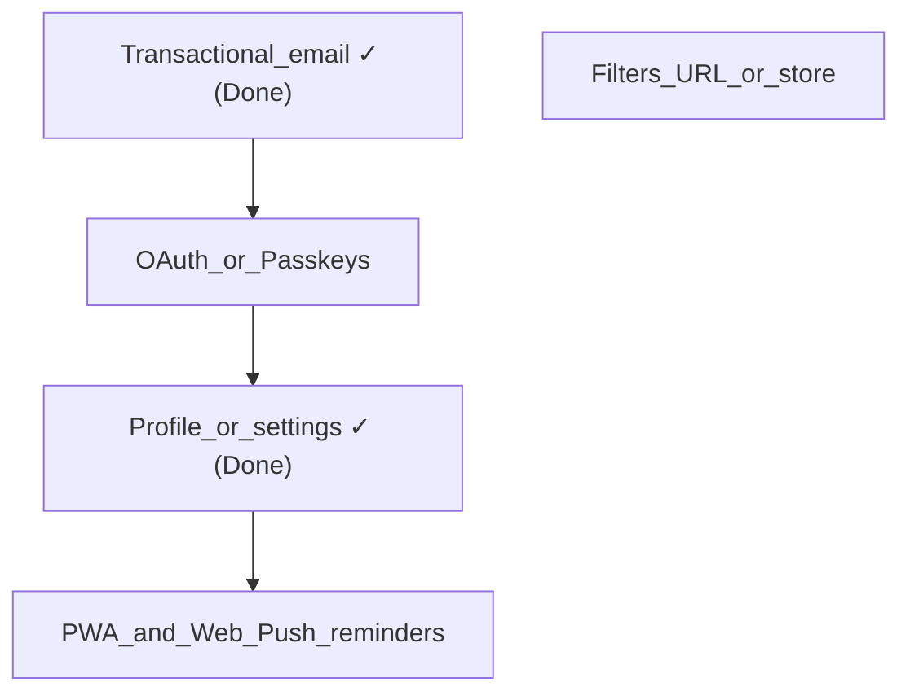

# Roadmap и бэклог

Краткий продуктовый и техбэклог: приоритеты, зависимости и идеи развития. Стек: Next.js (фронт), NestJS + JWT + Prisma (бэкенд), группы и персональные операции; фильтры на фронте через URL (`useTransactionsFilters`, `useGroupSelector`).

---

## Сделано

| Задача | Примечания |
|--------|------------|
| **Мультиязычность (i18n) на бэкенде** | `nestjs-i18n`, `AcceptLanguageResolver`, переводы по доменам (`errors`, `validation`, `userGroup`, `user`, `defaultCategories`); фронт передаёт `Accept-Language` из куки `NEXT_LOCALE` автоматически. Опционально позже: язык по умолчанию в профиле. |
| **Профиль и настройки (минимум)** | Страница профиля (`app/profile`, виджет `profile-overview`): `auth/me`, смена имени (`PATCH auth/profile`), смена пароля (`POST auth/change-password`), список сессий и отзыв (`GET` / `DELETE auth/sessions`), refresh по `deviceId`. |
| **Транзакционная email-рассылка** | `@nestjs-modules/mailer` + Nodemailer + Handlebars-шаблоны. Три флоу: подтверждение email при регистрации (+ повторная отправка / истёкшая ссылка), сброс пароля, подтверждение смены email в профиле. Бэкенд: поле `emailVerified` в `User`, модель `EmailToken` (`VERIFY_EMAIL` / `RESET_PASSWORD` / `CHANGE_EMAIL`), `EmailTokenService`, 6 новых эндпоинтов в `auth` и `user`. Фронт: 5 новых страниц (`/verify-email`, `/verify-email/sent`, `/forgot-password`, `/reset-password`, `/confirm-email-change`), badge «Подтверждена / Не подтверждена» в профиле, форма смены email. Конфигурируется через `MAIL_HOST/PORT/USER/PASS/FROM` + `APP_URL`. |
| **IDOR: операции и категории; групповой просмотр операций** | **Бэкенд (`finance-track-back`):** `GET/PUT/DELETE /operation/:id` — доступ на изменение только при `where: { id, userId }`; перед `create` и `update` операции проверяется `categoryId` текущего пользователя; `GET /category/:id` и `PUT /category/:id` — владелец через `userId` из JWT, `update` через `updateMany({ id, userId })`. `GET /operation/:id` для участника группы: чтение чужой операции возможно, если категория привязана к группе так же, как в `getUserGroupOperations` (`UserGroupRepository.findOperationByIdVisibleToGroupMember`); изменение/удаление по-прежнему только владельцу. В ответах деталки операции при необходимости включается `user: { name }`. **Фронт:** кнопки редактирования и удаления на деталке и защита маршрута формы редактирования — только если `operation.userId === me.id`; для чужой операции показывается блок «Автор операции» (`operationAuthor`). |
| **Локальные бэкапы PostgreSQL (Docker)** | **`finance-track-back`:** `scripts/backup-db.sh` (чтение `.env`, `docker exec` + `pg_dump`, сжатие `.sql.gz`, каталог `backups/`, удаление файлов старше 7 дней), `scripts/restore-db.sh`, `BACKUP_GUIDE.md`, каталог `backups/` в `.gitignore`. **На сервере дополнительно:** настроить **cron** (или systemd timer) по гайду, пользователь с доступом к Docker и к каталогу деплоя; при необходимости логирование и **проверка восстановления** из дампа; опционально копии off-site. |
| **Юридические документы (страницы + UX)** | **Политика ПДн:** `app/privacy/page.tsx`, `src/shared/lib/legal/privacy-ru-content.tsx`. **Пользовательское соглашение:** `app/terms/page.tsx`, `src/shared/lib/legal/terms-ru-content.tsx` (предмет — учёт финансов, пользовательский ввод данных, отказ от гарантий точности расчётов, «как есть», ограничение ответственности, правила аккаунта, блокировка; **текст явно не квалифицируется как публичная оферта** по ст.&nbsp;437 ГК РФ). Общие плейсхолдеры для публикации: `src/shared/lib/legal/legal-public-meta.ts` (базовый URL, формулировка Оператора как в политике, email). **Регистрация:** чекбокс — согласие на обработку ПДн и принятие пользовательского соглашения со ссылками в тексте (`registration-form`, i18n). **Вход:** отдельные ссылки на политику и соглашение под карточкой (`login-widget`). Маршрут `ROUTES.TERMS` в `src/shared/model/routes.ts`. Перед публичным продом: подставить реальные домен и реквизиты в `legal-public-meta.ts`, прогнать тексты юристом. |

---

## MVP и безопасность: обязательный минимум перед продакшном

Единый чеклист: **продукт**, **безопасность кода**, **эксплуатация**, **право**. Часть пунктов дублирует §1–§4 приоритетного бэклога и идеи из таблицы ниже — так и задумано: этот блок можно использовать как «стрелку в землю» перед релизом. Для закрытой беты на знакомых допускается сознательно отложить юр. часть и верификацию email, но **сброс пароля** и **IDOR** остаются желательными почти всегда; **бэкапы** в репозитории покрыты скриптами, а **рабочий прод** всё равно требует настройки расписания и проверки restore на сервере (см. «Сделано» и таблицу эксплуатации).

### Продукт и доступ

| Приоритет | Задача | Примечание |
|-----------|--------|------------|
| — | **Восстановление доступа** (сброс пароля по ссылке из письма) | **Сделано** — `POST /auth/forgot-password` + `POST /auth/reset-password`. |
| — | **Транзакционная почта** | **Сделано** — `@nestjs-modules/mailer`, Handlebars-шаблоны, `MailModule`. Требует заполнить `MAIL_*` env-переменные (Resend, Postmark и т.п.). |
| — | **Верификация email** (поле `emailVerified`, одноразовые токены) | **Сделано** — `POST /auth/verify-email`, `POST /auth/resend-verification`, badge в профиле. |
| — | **Профиль / сессии (минимум) + смена email** | **Сделано** — базовый профиль + смена email через `POST /user/request-email-change` / `POST /user/confirm-email-change`. |

### Безопасность приложения (код и конфиг)

| Приоритет | Задача | Примечание |
|-----------|--------|------------|
| — | **IDOR: операции** | **Сделано** — мутации только владельцу (`where: { id, userId }`); `GET` дополнительно разрешён участнику группы при видимости как в списке групповых операций; см. «Сделано». |
| — | **IDOR: категории** | **Сделано** — `GET`/`PUT` с проверкой владельца; `update` через `updateMany({ id, userId })`. |
| — | **Создание / обновление операции** | **Сделано** — перед `create` и `update`: категория принадлежит текущему пользователю (`requireCategoryForUser`). |
| Высокий | **Refresh-токен** | После проверки JWT сверять сырое значение refresh с **bcrypt-хешем** в БД (`AuthRepository`); иначе ротация и «один актуальный токен» ослаблены. |
| Высокий | **Парсинг `Cookie` для refresh** | Заменить хрупкий `split('=')` в refresh-стратегии на нормальный парсер / `req.cookies` (после `cookie-parser`). |
| Высокий | **Куки в проде** | `secure: true` для access/refresh при HTTPS; вынести в env (`NODE_ENV` / `COOKIE_SECURE`). |
| Средний | **Rate limiting** | Лимиты на `auth/login`, `auth/registration` (брутфорс). |
| Средний | **Swagger / OpenAPI** | В публичном проде отключить или закрыть (VPN, Basic Auth), не светить схему API. |
| Средний | **BFF** (`Next` route handler прокси) | После refresh повторный запрос к API должен пробрасывать те же заголовки, что и исходный (в т.ч. `Content-Type`, `Accept-Language`); минимизировать прокидывание всех клиентских заголовков на бэкенд без необходимости. |
| Низкий | **Access token в теле ответа** | Сейчас дублируется с httpOnly cookie; при желании ужать риск утечки через XSS на этапе логина — не отдавать токен в JSON, оставить только cookie. |
| Низкий | **Политика паролей** | Сейчас минимум 6 символов; для финансов — длиннее и/или проверка на утечки (опционально). |

### Эксплуатация (инфраструктура)

| Приоритет | Задача | Примечание |
|-----------|--------|------------|
| Критично | **Бэкапы PostgreSQL** | **Скрипты в репо** — см. «Сделано» (`BACKUP_GUIDE.md`). **На проде:** cron/systemd, регулярность и контроль успешности, периодическая **проверка восстановлением**; при необходимости хранение копий вне сервера. |
| Высокий | **Мониторинг и алерты** | 5xx, диск, БД, длительность запросов — минимальный набор. |
| Высокий | **Секреты** | `JWT_SECRET_CODE`, `JWT_REFRESH_SECRET`, `DATABASE_URL`, ключи почты — только в секрет-хранилище / env деплоя, не в репозитории. |
| Средний | **Откат релиза** | Понятный процесс деплоя бэка + фронта (и миграций Prisma). |

### Данные, группы, право

| Приоритет | Задача | Примечание |
|-----------|--------|------------|
| — | **Политика конфиденциальности** | **Сделано** — см. «Сделано»: `/privacy`, текст под 152-ФЗ, согласован с константами в `legal-public-meta.ts`. |
| — | **Пользовательское соглашение** | **Сделано** — `/terms`, акцепт при регистрации, не публичная оферта; см. «Сделано». |
| По продукту | **Роли в группе** | См. таблицу идей: для «только семья» часто терпимо без ролей; для незнакомцев в одной группе — почти обязательный следующий шаг. |

### Критерий «можно открывать шире бету»

- Пройдены пункты **критично** из таблиц выше (включая исправление **IDOR по операциям и категориям** — см. «Сделано» — и восстановление доступа через почту).
- Есть бэкапы **на проде** (не только скрипты в git: расписание + желательно проверка restore) и способ узнать, что API/БД «легли».
- Осознанно принято решение по верификации email. Юридические тексты на фронте **вынесены** (политика + пользовательское соглашение); перед широким публичным запуском — подстановка прод-URL/реквизитов и при необходимости правка у юриста.

---

## Приоритетный бэклог (основные темы)

Для каждого пункта ниже: **что**, **зачем**, **зависимости**, **сложность** (S/M/L — по желанию).

---

### 1. ~~Транзакционная email-рассылка~~ — **Сделано**

> Реализованы все три флоу: подтверждение email при регистрации, сброс пароля, смена email в профиле. Детали — в таблице «Сделано» выше.

**Что осталось вне реализации (намеренно отложено):**

- **Magic link** (§3) — те же инфраструктурные примитивы, но продуктовое решение отдельно.
- Маркетинговые **email-дайджесты** — отдельный продуктовый слой (подписка/отписка), не смешивать с транзакционными письмами.
- Настройка SMTP-провайдера в проде: заполнить `MAIL_HOST/PORT/USER/PASS/FROM` в env (Resend, Postmark и т.п.); без этого отправка молча падает, приложение работает.

---

### 2. Фильтрация статистики и операций: стор или рефакторинг URL

**Что:** Один источник правды для периода, типа операции, категории и совместимости списка операций со статистикой.

**Сейчас:** Фильтры транзакций — в `src/feature/operation-filters/model/use-transactions-filters.ts`, синхронизация с **URL** (`type`, `period`, `startDate`, `endDate`, `categoryId`). Выбор группы — `src/feature/group-selector/model/use-group-selector.ts`, тоже через URL (`groupId`).

**Отдельный стор (Zustand и т.п.) имеет смысл, если нужно:**

- синхронизация между вкладками без опоры на URL;
- меньше `router.push` и гонок с `useEffect`, подставляющих дефолты в URL;
- общее состояние для виджетов вне одного route.

**Альтернатива:** Рефакторинг — единый модуль разбора `URLSearchParams`, URL остаётся single source of truth.

**Критерий успеха:** Нет дублирования между списком операций и статистикой; шаринг ссылки сохраняет фильтры.

**Зависимости:** Относительно независимо от остального.

**Сложность:** S–M.

---

### 3. Другие способы авторизации («быстрее» вход)

**Что:** Снизить трение при входе и регистрации.

**Сейчас:** NestJS, JWT, refresh по устройству (`deviceId`), email + пароль.

**Направления:**

- **OAuth2** (Google / Apple / GitHub)
- **Magic link** (email)
- **Passkeys / WebAuthn**

**Решение в бэклоге:** Самописное расширение модуля `auth` vs внешний поставщик (Clerk, Auth0, Supabase Auth и т.д.).

**Зависимости:** Влияет на экран настроек / профиля (привязка провайдеров, смена email).

**Сложность:** M–L.

---

### 4. PWA и Web Push (после базового профиля)

**Порядок:** Базовый профиль уже в **«Сделано»**; дальше **PWA** и **напоминания** (например: «время внести расходы»).

**Состав работ:**

| Часть | Содержание |
|-------|------------|
| **PWA** | `manifest`, service worker (Next.js / Workbox или встроенные средства), иконки, `display: standalone`, при необходимости базовый офлайн/кэш. |
| **Web Push** | Разрешение (`Notification.requestPermission`), подписка через Push API, хранение **subscription** у пользователя на бэкенде, VAPID-ключи, эндпоинты подписки/отписки. |
| **Расписание** | Для «каждый день в 20:00» нужен **планировщик на сервере** (cron/worker), который рассылает push по сохранённым подпискам; только клиентский таймер ненадёжен при закрытой вкладке. |
| **UI** | Время напоминания, вкл/выкл — в **профиле/настройках**. |

**Зависимости:** Расширение экрана профиля (см. «Сделано») как место для настроек напоминаний.

**Сложность:** M–L.

---

## Идеи развития (кандидаты)

| Направление | Зачем |
|-------------|--------|
| **Роли в группе** (владелец / редактор / только чтение) | В схеме пока нет `role` / `permission` — для совместных групп частый шаг. |
| **Мультитенантность на бэкенде** | Не путать с i18n: отдельная крупная тема (tenant, изоляция данных), если понадобится SaaS или жёсткая изоляция. |
| **Экспорт / импорт (CSV)** | Резерв и перенос из других приложений. |
| **Повторяющиеся операции** | Подписки, аренда. |
| **Бюджеты / лимиты по категории** | Логично после статистики. |
| **Статистика по участникам группы** | Не только разбивка по категориям: по каждому пользователю — сколько потратил за выбранный период в группе (прозрачность совместных расходов). Зависит от того, что операции в группе привязаны к автору. |
| **Предупреждение при смене дефолтной категории** | В форме редактирования категории: если пользователь меняет признак «дефолтная категория», показать предупреждение — это может повлиять на дефолтное сопоставление групповых категорий с его персональными. |
| **Несколько валют + курс** | Если аудитория не только RUB. |
| **Полнотекстовый поиск** по комментариям и суммам | Когда операций много. |
| **PWA + Web Push** | См. §4 в приоритетном бэклоге — после базового профиля («Сделано»). |
| **Email-дайджесты** | Отдельно от push, если нужно без браузера. |
| **2FA** | При усилении безопасности (OAuth, почта). |
| **Интеграции с банками** | Дорого в поддержке; отдельная ветка продукта. |

---

## Зависимости (схема)

**Смысл:** Транзакционная почта (§1) — **сделана**, база для смежных сценариев auth (OAuth, magic link) готова. Базовый профиль + смена email **сделаны**. Следующие естественные шаги: OAuth/Passkeys (§3) и PWA/push (§4); фильтры относительно автономны. **Роли в группе** — отдельная тема из таблицы идей, на схеме без жёстких стрелок.

---

## Ссылки на код (фронт)

- Фильтры транзакций: `src/feature/operation-filters/model/use-transactions-filters.ts`
- Выбор группы: `src/feature/group-selector/model/use-group-selector.ts`
- Юридические документы: `src/shared/lib/legal/` (`legal-public-meta.ts`, `privacy-ru-content.tsx`, `terms-ru-content.tsx`), страницы `app/privacy/page.tsx`, `app/terms/page.tsx`; согласие при регистрации — `src/feature/auth/ui/registration-form.tsx`

Бэкенд: схема БД — репозиторий `finance-track-back`, файл `prisma/schema.prisma`; авторизация — `src/auth/` (NestJS).
