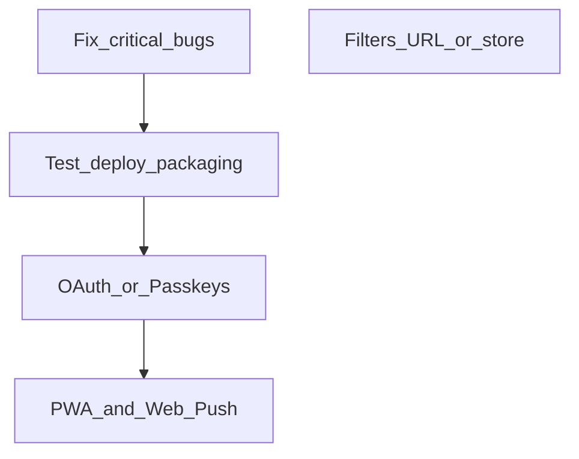

# Roadmap и бэклог

Незакрытые задачи, баги и идеи. Закрытое — в [DONE.md](./DONE.md).

Стек: Next.js (фронт), NestJS + JWT + Prisma (бэкенд); фильтры через URL (`useTransactionsFilters`, `useGroupSelector`).

Для закрытой тестовой среды «для себя» приоритет — блок **критично перед стендом**. Публичный прод — ещё безопасность, эксплуатация и право (реквизиты в `legal-public-meta.ts`).

---

## Критично перед тестовым деплоем

Ломают стенд или сессию. Без этого выкладка будет казаться «сломанной».

| Приоритет | Задача | Что не так | Где |
|-----------|--------|------------|-----|
| Критично | **Редактирование группы — 404** | Фронт шлёт `PATCH /user-group/:id`, на бэке маршрута нет (`UpdateUserGroupDto` есть, эндпоинт не подключён). | Фронт: `useGroupUpdate` в `src/shared/api/queries/groups/groups.ts`. Бэк: `user-group.controller.ts`. |
| Критично | **BFF: refresh для PUT/POST/PATCH** | После 401 повтор запроса без `Content-Type` / `Accept-Language`; access берётся из **старых** request-cookies, не из ответа refresh. Через ~15 мин мутации отваливаются. | `src/app/api/[...path]/route.ts` |
| Критично | **Цвет и иконка категории при редактировании** | Форма шлёт `color`/`icon`, `UpdateCategoryDto` их нет, репозиторий пишет только `name`. | Бэк: `category.repository.ts` → `updateCategory`, `UpdateCategoryDto` |
| Высокий | **Инвалидация кэша после create/update** | `invalidateQueries` помечает stale, но у списков `refetchOnMount: false` — после перехода на список данные старые (создал группу — в списке нет). | Хуки в `src/shared/api/queries/` (`useGroups` и аналоги) |
| Высокий | **Куки при HTTPS** | `secure: false` зашит. На HTTP-стенде ок; на HTTPS сессия может не прилипать. Вынести в env (`COOKIE_SECURE` / `NODE_ENV`). | `auth.controller.ts` |
| Высокий | **Парсинг Cookie для refresh** | Хрупкий `split('=')` в refresh-стратегии. Заменить на `req.cookies` (уже есть `cookie-parser`). | `src/auth/strategies/refresh-jwt.strategy.ts` |
| Высокий | **Сверка refresh с хешем в БД** | Токен в БД хешируется bcrypt, при refresh **не сравнивается** — достаточно валидного JWT + `userId`/`deviceId`. | `AuthService.refresh`, `AuthRepository` |

---

## UX и мелкий продукт

Заметки с поля + дыры, которые видны сразу после логина.

| Приоритет | Задача | Примечание |
|-----------|--------|------------|
| Высокий | **Повторная отправка письма верификации из профиля** | Эндпоинт `POST /auth/resend-verification` и форма на `/verify-email` есть; в профиле только badge «не подтверждена». |
| Высокий | **Empty-экраны** | Где списка нет — текст + CTA. Пример: группы — «групп нет» и кнопка создать первую. `GroupListPlaceholder` — заглушка, не подключён. То же для категорий и приглашений. У операций за период текст уже есть. |
| Средний | **Скелетоны при загрузке** | Есть точечно (профиль, часть групп). Списки операций / категорий / групп грузятся пустотой. |
| Средний | **Маски сумм** | В ценовых инпутах — разделение тысяч пробелом. |
| Низкий | **SMTP на стенде** | Без `MAIL_*` приложение живёт, письма (сброс пароля, верификация) молча не уходят. Для теста — Mailpit/Resend + `APP_URL` = публичный URL фронта. |

---

## Безопасность (ещё открыто)

IDOR по операциям/категориям и базовый auth — в [DONE.md](./DONE.md).

| Приоритет | Задача | Примечание |
|-----------|--------|------------|
| Средний | **Rate limiting** | Лимиты на `auth/login`, `auth/registration` (брутфорс). |
| Средний | **Swagger / OpenAPI** | В публичном доступе отключить или закрыть (VPN, Basic Auth). |
| Средний | **BFF: лишние заголовки** | Не прокидывать на бэкенд все клиентские заголовки без необходимости; после refresh — тот же набор, что у исходного запроса (см. критичный пункт про PUT/POST/PATCH). |
| Низкий | **Access token в JSON** | Дублируется с httpOnly cookie; можно не отдавать в теле ответа. |
| Низкий | **Политика паролей** | Сейчас минимум 6 символов. |
| Низкий | **ValidationPipe whitelist** | Сейчас extra-поля с клиента не отсекаются. |

---

## Эксплуатация и деплой

Скрипты бэкапа в репо — в [DONE.md](./DONE.md). Упаковки приложения нет: только Postgres в `docker-compose.yml`.

| Приоритет | Задача | Примечание |
|-----------|--------|------------|
| Критично | **Бэкапы на стенде/проде** | Cron/systemd по `BACKUP_GUIDE.md`, контроль успешности, хотя бы раз проверить restore. |
| Высокий | **Упаковка деплоя** | Dockerfile (Nest + Next) или полный compose (front + api + db); развести порты (сейчас оба по умолчанию 3000); reverse proxy и HTTPS. Env: `CLIENT_URL`, `APP_URL`, `NEXT_API_BACKEND`, `NEXT_PUBLIC_API_BFF` — на публичный origin, не localhost. |
| Высокий | **Мониторинг и алерты** | 5xx, диск, БД, длительность запросов — минимум, чтобы понять, что стенд лёг. |
| Высокий | **Секреты** | `JWT_*`, `DATABASE_URL`, почта — только env деплоя, не в git. |
| Средний | **Откат релиза** | Понятный процесс выкладки бэка + фронта и миграций Prisma. |

### Критерий «можно открывать шире бету»

- Закрыт блок **критично перед тестовым деплоем**.
- Бэкапы крутятся по расписанию, есть способ узнать, что API/БД легли.
- SMTP настроен или сознательно не используется.
- Юр. тексты вынесены; перед широким запуском — прод-URL/реквизиты в `legal-public-meta.ts`.

---

## Приоритетный бэклог (крупные темы)

### 1. Фильтрация статистики и операций: стор или рефакторинг URL

**Что:** Один источник правды для периода, типа, категории; список операций и статистика не разъезжаются.

**Сейчас:** `src/feature/operation-filters/model/use-transactions-filters.ts` и `src/feature/group-selector/model/use-group-selector.ts` — URL (`type`, `period`, `startDate`, `endDate`, `categoryId`, `groupId`).

**Стор (Zustand и т.п.), если нужно:** синхронизация вкладок без URL; меньше `router.push` и гонок с `useEffect`; состояние вне одного route.

**Альтернатива:** единый разбор `URLSearchParams`, URL остаётся source of truth.

**Критерий:** нет дублирования список/статистика; шаринг ссылки сохраняет фильтры. Сложность: S–M.

### 2. Другие способы авторизации

Сейчас: email + пароль, JWT, refresh по `deviceId`.

Направления: OAuth2 (Google / Apple / GitHub), magic link, Passkeys / WebAuthn. Самописный `auth` vs Clerk/Auth0/Supabase.

Транзакционная почта уже есть — примитивы для magic link готовы, продуктово это отдельно. Сложность: M–L.

### 3. PWA и Web Push

Базовый профиль готов. Дальше напоминания («время внести расходы»).

| Часть | Содержание |
|-------|------------|
| **PWA** | `manifest` уже есть; нужен service worker, офлайн/кэш по необходимости. |
| **Web Push** | разрешение, subscription на бэкенде, VAPID, эндпоинты подписки. |
| **Расписание** | cron/worker на сервере; клиентский таймер при закрытой вкладке ненадёжен. |
| **UI** | время и вкл/выкл в профиле. |

Сложность: M–L.

---

## Идеи развития

| Направление | Зачем |
|-------------|--------|
| **Роли в группе** (владелец / редактор / только чтение) | В схеме нет `role` / `permission`. Для «только семья» терпимо; для чужих в одной группе — почти обязательно. |
| **Мультитенантность** | Не путать с i18n: tenant и изоляция, если понадобится SaaS. |
| **Экспорт / импорт (CSV)** | Резерв и перенос из других приложений. |
| **Повторяющиеся операции** | Подписки, аренда. |
| **Бюджеты / лимиты по категории** | После статистики. |
| **Статистика по участникам группы** | Кто сколько потратил за период; операции уже с автором. |
| **Предупреждение при смене дефолтной категории** | Влияет на сопоставление групповых категорий с личными. |
| **Несколько валют + курс** | Если не только RUB. |
| **Полнотекстовый поиск** | Комментарии и суммы, когда операций много. |
| **Email-дайджесты** | Отдельно от push. |
| **2FA** | При усилении безопасности. |
| **Интеграции с банками** | Дорого в поддержке. |

---

## Зависимости

```mermaid
flowchart TD
  bugs["Fix_critical_bugs"]
  deploy[Test_deploy_packaging]
  auth[OAuth_or_Passkeys]
  pwa[PWA_and_Web_Push]
  filters[Filters_URL_or_store]

  bugs --> deploy
  deploy --> auth
  auth --> pwa
```

Сначала стабильный стенд (баги + упаковка), потом OAuth/Passkeys и PWA. Фильтры автономны. Роли в группе — из таблицы идей, без жёсткой стрелки.

---

## Ссылки на код (открытые темы)

- Фильтры: `src/feature/operation-filters/model/use-transactions-filters.ts`
- Выбор группы: `src/feature/group-selector/model/use-group-selector.ts`
- BFF: `src/app/api/[...path]/route.ts`
- Апдейт группы (фронт): `src/shared/api/queries/groups/groups.ts` (`useGroupUpdate`)
- Апдейт категории (бэк): `finance-track-back` → `src/category/`
- Refresh: `finance-track-back` → `src/auth/strategies/refresh-jwt.strategy.ts`, `AuthService.refresh`
